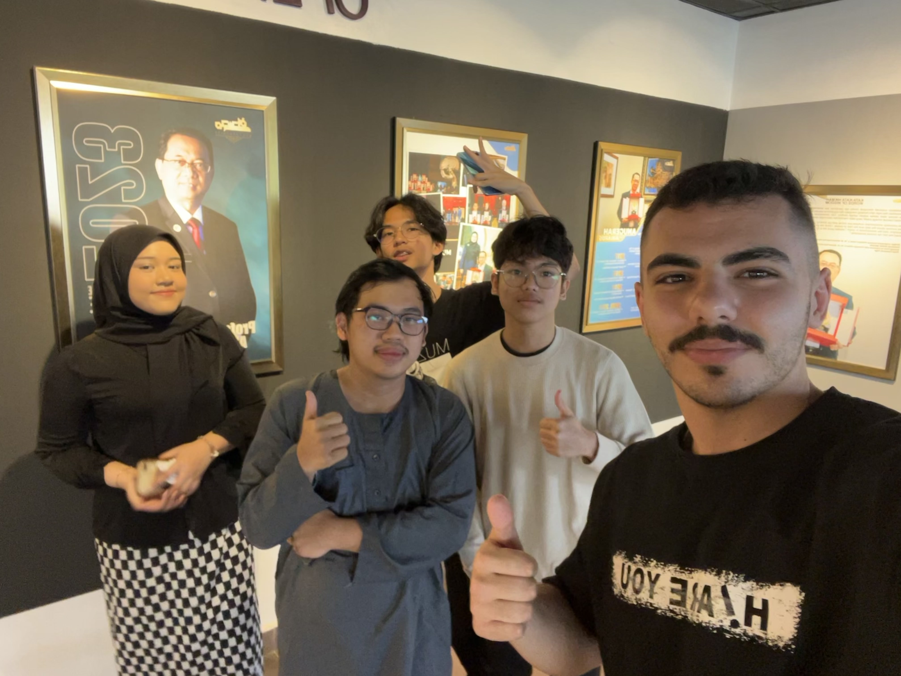

<h1 align="center">🖱️ ClickSquad</h1>

<em>Everything starts with a click.</em>

---
 
We are <strong>ClickSquad</strong> — a group of passionate Computing students from Universiti Teknologi Malaysia (UTM JB), working together on an exciting Human-Computer Interaction (HCI) project.

Our group name represents more than just a cool tagline — it’s the core of what we do. Every digital experience begins with a click, and behind that click lies careful design, thoughtful interaction, and user-centered thinking. That’s exactly what we aim to explore, evaluate, and improve through our work.

Whether we’re running usability tests, analyzing interfaces, or building prototypes, we work as a squad — united by our curiosity, creativity, and drive to build better interactions between humans and technology.

---

### 💡 What to Expect from Our Blog:
- 📌 Project deliverables & updates
- 👥 Team introduction & behind-the-scenes
- 🧠 Reflections on UX, usability, and design

Stay tuned as we click our way through the world of HCI!

> <strong>"From every click, comes a better experience."</strong>

---

Made with curiosity & collaboration — by Click Squad ✨

